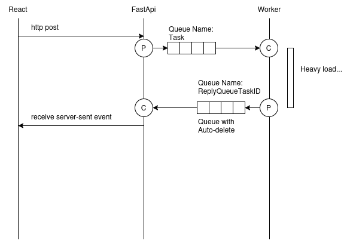

# rabbitmqtask

This is a simple setup to show how to use RabbitMQ to:
* decouple the WebApi, in this case FastApi, from the workers (possible heavy processing, database call, or other bottleneck in terms of scalability);
* update the UI, in this case React, using Server-Sent Events to be efficient (avoid polling);

The state diagram is the following:

From a queue point of view is this:

